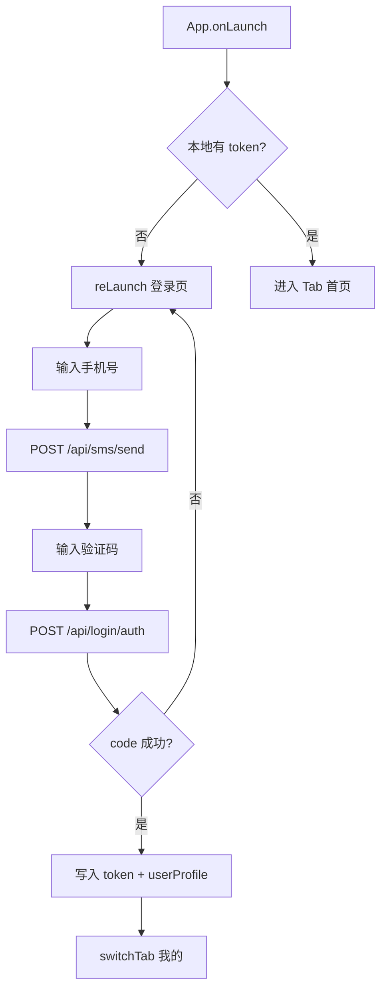
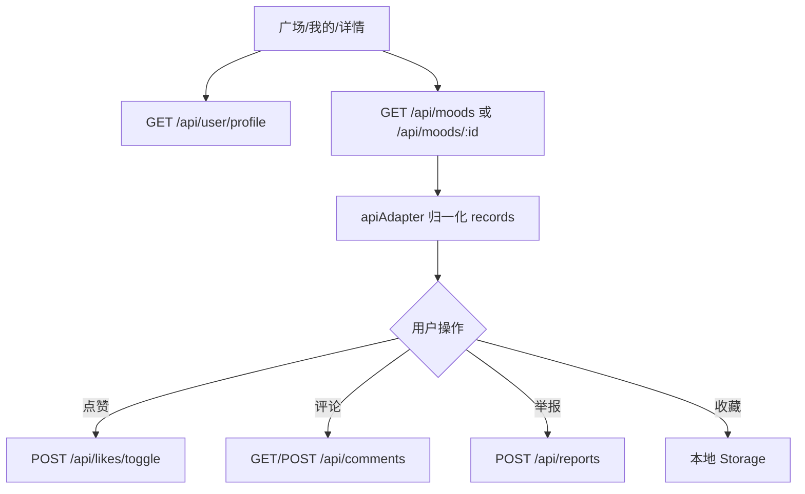
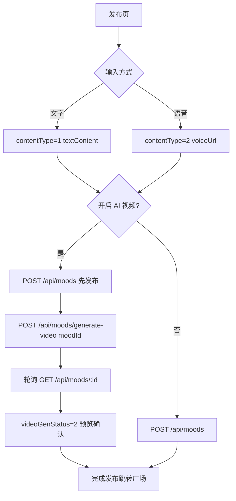

# 心情星球 — UniApp 移动端

**在线地址**：https://ruanyi.top/xinqing-social-app/

基于 **UniApp + Vue 3 + Vite** 的心情社交应用，支持 H5、微信小程序、App 多端运行。用户可发布心情、浏览广场、互动评论、生成 AI 视频，并使用在线客服与消息中心。

> **接口文档来源**：项目根目录 [`C端接口 (App).md`](./C端接口%20(App).md)（MoodSocial API v1.0）  
> **在线文档**：http://117.72.185.92:19500/doc.html（Knife4j，部分环境可能 403）

## 项目特性

- **多端适配**：H5 / 微信小程序 / App（条件编译）
- **心情社交**：发布、浏览、点赞、评论、收藏、举报
- **AI 能力**：语音录制与转写、AI 视频生成（含本地额度管理）
- **在线客服**：静态客服列表 + 本地模拟对话（无后端接口）
- **真实后端联调**：默认走 `http://117.72.185.92:19500`，`utils/apiAdapter.js` 做字段适配
- **自定义 TabBar**：`AppTabBar` 组件替代原生 TabBar，全端样式统一

## 技术栈

| 类别 | 技术 |
| --- | --- |
| 框架 | UniApp 3.x、Vue 3.4 |
| 构建 | Vite 5 |
| 样式 | SCSS、rpx 响应式 |
| 状态 | `store/index.js`（Vue reactive + 本地存储） |
| 后端协议 | MoodSocial `{ code, message, jumpRouter, data }` |
| 适配层 | `utils/apiAdapter.js`（文档字段 ↔ 页面模型） |

## 项目结构

```
uniapp-demo/
├── C端接口 (App).md        # 官方 C 端接口文档（Markdown 导出）
├── api/                    # 接口封装（已对齐文档路径）
│   ├── auth.js             # 认证
│   ├── mood.js             # 心情
│   ├── comment.js          # 评论
│   ├── like.js             # 点赞
│   ├── user.js             # 用户资料
│   ├── tag.js              # 标签
│   └── report.js           # 举报
├── utils/
│   ├── request.js          # 网络请求（token、成功码、Mock 开关）
│   ├── apiAdapter.js       # 接口字段与分页适配
│   ├── tabBar.js           # TabBar 工具
│   ├── aiQuota.js          # AI 视频额度（本地）
│   ├── customerAgents.js   # 客服静态数据
│   ├── voiceRecord.js      # 录音适配
│   └── violation.js        # 违规词检测
├── mock/index.js           # 本地 Mock（USE_MOCK=true 时启用）
├── pages/                  # 页面
├── components/             # 公共组件
└── ...
```

## 页面与导航

### TabBar（5 个主 Tab）

| Tab | 路径 | 说明 |
| --- | --- | --- |
| 我的 | `pages/index/index` | 我的心情列表（`onlyMine=true`） |
| 广场 | `pages/space/space` | 全站动态、搜索、排序、收藏 |
| 发布 | `pages/publish/publish` | 文字/语音发布、AI 视频 |
| 客服 | `pages/match/match` | 在线客服列表 |
| 消息 | `pages/settings/settings` | 消息通知中心 |

### 非 Tab 页面

| 页面 | 路径 | 说明 |
| --- | --- | --- |
| 登录 | `pages/login/login` | 无 token 时强制跳转 |
| 动态详情 | `pages/space/detail` | 详情、评论、点赞、举报 |
| 客服会话 | `pages/match/chat` | 本地模拟对话 |
| 个人中心 | `pages/profile/profile` | 资料、统计、登出 |
| 个人子页 | `pages/profile/sub` | 心情/收藏、换绑、编辑资料 |
| 编辑资料 | `pages/settings/edit-profile` | 头像、昵称、简介 |
| 关于我们 | `pages/settings/about` | 版本、协议入口 |

## 业务流程图

### 应用启动与登录



### 心情浏览与互动



### 发布心情 + AI 视频



---

## 网络请求

### 基础配置（`utils/request.js`）

| 配置项 | 值 |
| --- | --- |
| Base URL | `http://117.72.185.92:19500` |
| 超时 | 10s |
| 认证 Header | `mood-social-satoken: Bearer {token}` |
| Content-Type | `application/json` |
| Mock 开关 | `USE_MOCK = false`（改为 `true` 走 `mock/index.js`） |

### 统一响应格式

文档示例 `code: 0`，**线上实测成功码为 `1000`**，项目同时兼容 `0` / `200` / `1000`。

**成功（单对象）**

```json
{
  "code": 1000,
  "message": "成功",
  "jumpRouter": null,
  "data": {}
}
```

**成功（分页）**

```json
{
  "code": 1000,
  "message": "成功",
  "jumpRouter": null,
  "data": {
    "total": 0,
    "size": 10,
    "current": 1,
    "records": []
  }
}
```

**失败**

```json
{
  "code": 400,
  "message": "验证码错误或已过期",
  "jumpRouter": null,
  "data": null
}
```

- 业务失败：展示 `message` 字段
- `code === 401`：清除 token 并 `reLaunch` 登录页

### 字段适配（`utils/apiAdapter.js`）

| 接口字段（文档） | 页面使用字段 |
| --- | --- |
| `data.records` | `rows` |
| `id` | `moodId` |
| `nickName` | `nickname` |
| `textContent` | `content` |
| `publishTime`（毫秒时间戳） | `createTime`（格式化字符串） |
| `videoGenStatus` | `videoStatus`（字符串） |
| `tags`（`string[]`） | `tags`（`{ tagId, tagName }[]`） |
| `commentText` | `content` |
| `bio` | `signature` |
| `phoneNumber` | `phone` |
| 点赞 `targetType` 1/2 | 页面传 `'0'`=心情、`'1'`=评论 自动映射 |

---

## 接口文档

以下路径与 [`C端接口 (App).md`](./C端接口%20(App).md) 一致；封装见 `api/*.js`。

### C 端认证

#### POST `/api/sms/send` — 发送短信验证码

| 方向 | 字段 | 类型 | 必填 | 说明 |
| --- | --- | --- | --- | --- |
| 入参 | phone | string | 是 | 11 位手机号，60s 内不可重复发送 |
| 出参 | data | object | — | 一般为 null |

**调用**：`login`、`profile/sub`

---

#### POST `/api/login/auth` — 手机号验证码登录

| 方向 | 字段 | 类型 | 必填 | 说明 |
| --- | --- | --- | --- | --- |
| 入参 | phone | string | 是 | 手机号 |
| 入参 | code | string | 是 | 6 位验证码 |
| 入参 | inviteCode | string | 否 | 邀请码（注册时可选） |
| 出参 data | token | string | — | Bearer Token |
| 出参 data | userProfile | object | — | 见用户资料结构 |

**调用**：`login`、`profile/sub`

---

#### POST `/api/auth/logout` — 退出登录

需登录。无请求体。

**调用**：`profile/profile`

---

### C 端用户

#### GET `/api/user/profile` — 获取当前用户资料

| 出参 data 字段 | 类型 | 说明 |
| --- | --- | --- |
| userId | number | 用户 ID |
| phoneNumber | string | 脱敏手机号 |
| nickName | string | 昵称 |
| avatar | string | 头像 URL |
| bio | string | 个人简介 |
| sex | number | 0 未知 / 1 男 / 2 女 |
| inviteCode | string | 我的邀请码 |
| status | number | 1 正常 / 0 停用 |

**调用**：`index`、`space`、`detail`、`settings`、`profile`、`profile/sub`、`edit-profile`

---

#### PUT `/api/user/profile` — 更新资料

| 入参 | 类型 | 说明 |
| --- | --- | --- |
| nickName | string | 昵称 2–16 字 |
| bio | string | 简介最多 100 字 |
| sex | number | 性别 |

页面传 `nickname`/`signature` 时由适配层转为 `nickName`/`bio`。

**调用**：`profile/sub`、`edit-profile`

---

#### POST `/api/user/avatar` — 上传头像

- `multipart/form-data`，字段名 `file`
- 出参 `data.avatarUrl`（OSS 预留，可能为空）

**调用**：`profile/sub`、`edit-profile`

---

### C 端心情

#### GET `/api/moods` — 心情列表

| 入参 | 类型 | 说明 |
| --- | --- | --- |
| pageNum | number | 页码，默认 1 |
| pageSize | number | 每页条数，默认 10 |
| sortMode | string | `time` 最新（默认）/ `today_hot` 今日最热 / `all_hot` 历史最热 |
| contentType | string | 1 文字 / 2 语音 / 3 AI 视频 |
| keyword | string | 关键字模糊搜索 |
| tagName | string | 标签名过滤 |
| onlyMine | boolean | `true` 仅查自己（需登录） |

**records 单项（AppMoodVo）**

| 字段 | 说明 |
| --- | --- |
| id | 心情 ID |
| userId / nickName / avatar | 发布者信息 |
| contentType | 1 文字 / 2 语音 / 3 AI 视频 |
| textContent / voiceUrl / voiceDuration | 内容 |
| videoUrl / videoCoverUrl / videoDuration | 视频 |
| videoGenStatus | 0 未生成 / 1 生成中 / 2 成功 / 3 失败 |
| publishTime | 毫秒时间戳 |
| likeCount / commentCount / liked | 互动 |
| auditStatus | 0 待审核 / 1 通过 / 2 拒绝 |
| tags | 标签名数组 |

**页面调用**

| 页面 | 参数 |
| --- | --- |
| `index` | `{ onlyMine: true, sortMode: 'time' }` |
| `space` | `{ sortMode, keyword, pageNum, pageSize }` |
| `profile` / `profile/sub` | `{ onlyMine: true }` |

---

#### GET `/api/moods/{id}` — 心情详情

路径参数 `id`。响应结构同列表单项。

**调用**：`space/detail`、`pollMoodVideo` 轮询

---

#### POST `/api/moods` — 发布心情

| 入参 | 类型 | 必填 | 说明 |
| --- | --- | --- | --- |
| contentType | number | 是 | 1 文字 / 2 语音 / 3 AI 视频（3 不可直接发） |
| textContent | string | 条件 | contentType=1 必填 |
| voiceUrl | string | 条件 | contentType=2 必填（OSS 预留） |
| voiceDuration | number | 否 | 语音秒数 |
| tags | string[] | 否 | 最多 5 个 |

发布后 `auditStatus=0` 待审核，通过后广场可见。

**调用**：`publish`

---

#### POST `/api/moods/generate-video` — 提交 AI 视频生成

| 入参 | 类型 | 必填 | 说明 |
| --- | --- | --- | --- |
| moodId | number | 是 | 已发布的文字/语音心情 ID |

提交后 `videoGenStatus=1`，需轮询详情直至 `2` 成功或 `3` 失败。

出参 `data`：`moodId`、`videoGenStatus`、`videoTaskId`、`message`

**调用**：`publish` → `pollMoodVideo`

---

#### DELETE `/api/moods/{id}` — 删除心情

软删除，仅能删自己的内容。需登录。

**调用**：`profile/sub`

---

#### GET `/api/moods/match` — 匹配心情

从广场随机匹配一条与当前用户最近发布内容类型相近的心情（排除自己）。需登录。

出参 `data.mood`：匹配到的心情；`data.message`：状态描述。

**说明**：`api/mood.js` 已封装，**当前无页面调用**（客服 Tab 为纯前端）。

---

### C 端评论

#### GET `/api/comments` — 评论列表

| 入参 | 类型 | 必填 |
| --- | --- | --- |
| moodId | number | 是 |
| pageNum / pageSize | number | 否 |

**records 单项**：`id`、`moodId`、`userId`、`nickName`、`avatar`、`parentId`、`rootId`、`replyUserId`、`replyNickName`、`commentText`、`replyCount`、`createTime`

**调用**：`space/detail`

---

#### POST `/api/comments` — 发表评论/回复

| 入参 | 类型 | 说明 |
| --- | --- | --- |
| moodId | number | 心情 ID |
| commentText | string | 评论内容 |
| parentId / rootId / replyUserId | number | 回复时填写 |

**调用**：`space/detail`

---

#### DELETE `/api/comments/{id}` — 删除评论

软删除自己的评论。`CommentPopup` 已封装，当前未接入页面。

---

### C 端点赞

#### POST `/api/likes/toggle` — 切换点赞

| 入参 | 类型 | 说明 |
| --- | --- | --- |
| targetId | number | 心情或评论 ID |
| targetType | number | **1 心情 / 2 评论** |

出参 `data`：`liked`、`likeCount`

**调用**：`index`、`space`、`detail`

---

### C 端举报

#### POST `/api/reports` — 提交举报

| 入参 | 类型 | 说明 |
| --- | --- | --- |
| targetType | number | 1 内容 / 2 评论 / 3 用户 |
| targetId | number | 对象 ID |
| reason | string | 预设原因：包含不雅内容、垃圾广告、虚假信息、违法违规、其他 |
| extra | string | 补充说明（≤200 字） |

**调用**：`ReportPopup`（`index`、`detail`）

---

### C 端标签

#### GET `/api/tags` — 预设标签列表

返回热门标签 Top 50，无需登录。

出参 `data[]`：`id`、`tagName`、`refCount`

**说明**：`api/tag.js` 已封装；发布页当前用手动输入标签，未调用此接口。

---

## 页面 ↔ 接口映射

| 页面 | 使用的接口 |
| --- | --- |
| `login` | 发短信、登录 |
| `index` | 用户资料、我的心情列表、点赞、举报 |
| `space` | 用户资料、广场列表、点赞 |
| `publish` | 发布心情、生成视频、轮询详情 |
| `detail` | 详情、评论列表、发评论、点赞、举报 |
| `settings` | 用户资料（消息为本地数据） |
| `profile` | 用户资料、我的心情、登出 |
| `profile/sub` | 资料 CRUD、头像、删心情、换绑登录 |
| `edit-profile` | 用户资料、更新、头像 |
| `match` / `chat` | 无后端接口 |

## 本地能力（非接口）

| 模块 | 文件 | 说明 |
| --- | --- | --- |
| AI 视频额度 | `utils/aiQuota.js` | 每日生成次数、互动奖励 |
| 违规词检测 | `utils/violation.js` | 发布前本地拦截 |
| 收藏 | `space` / `detail` | 本地 Storage |
| 发布草稿 | `publish` | `publish_latest_draft` |
| 客服 | `utils/customerAgents.js` | 静态问答 |
| Mock | `mock/index.js` | `USE_MOCK=true` 时启用 |

## 开发指南

### 环境要求

- Node.js >= 16.14.0
- npm >= 6.0.0

### 安装与运行

```bash
npm install
npm run dev:h5          # H5
npm run dev:mp-weixin   # 微信小程序
npm run dev:app         # App
npm run build:h5
```

### 切换 Mock / 真实后端

`utils/request.js`：

```javascript
const USE_MOCK = false;  // true = 本地 Mock（验证码 123456）
```

### 构建图标字体

```bash
npm run iconfont:build
```

## 联调说明

1. **登录**：需真实短信验证码；Mock 模式下可用 `123456`
2. **成功码**：线上返回 `code: 1000`，非文档示例的 `0`
3. **语音发布**：`voiceUrl` 依赖 OSS，未接入时建议「转文字发布」
4. **AI 视频**：先发布心情再调 `generate-video`，轮询详情查进度
5. **H5 跨域**：若浏览器报 CORS，需后端放行或在 `vite.config.ts` 配置 `/api` 代理
6. **评论点赞**：评论列表会返回 `liked` / `likeCount`，刷新后状态可恢复

## 已知说明

1. **CommentPopup**：已实现，评论主流程在 `space/detail` 内联完成
2. **matchMoods / getPresetTags**：已封装，暂无页面调用
3. **关于页协议**：`settings/about` 为占位，需接真实 H5 协议
4. **客服聊天**：纯前端，无 IM 后端

## 许可证

MIT License
