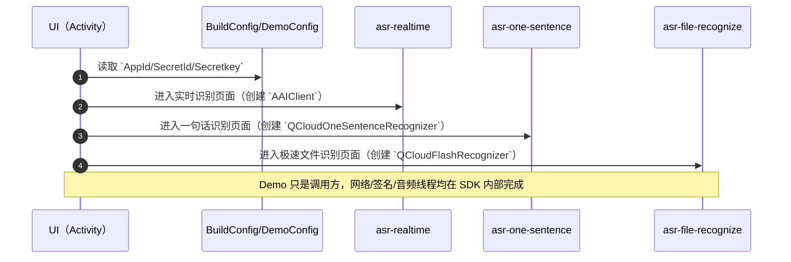
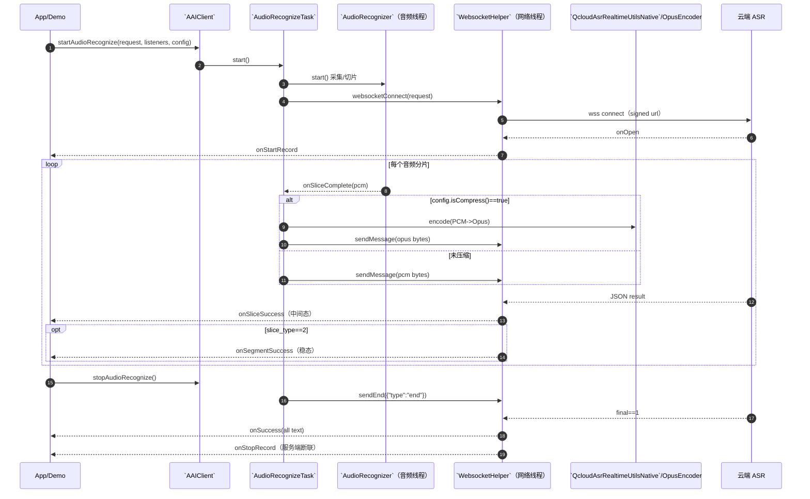
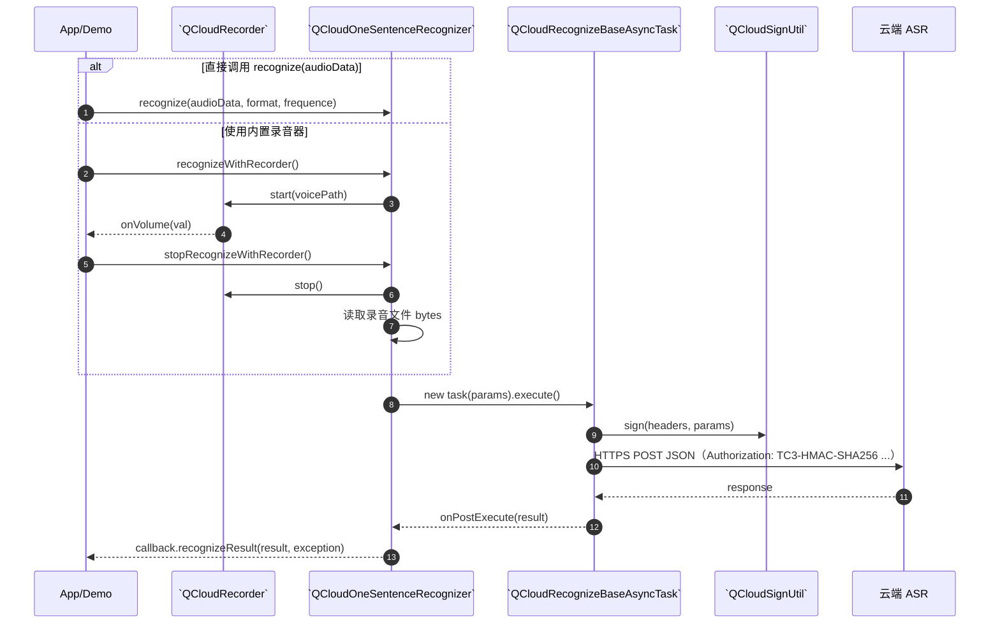
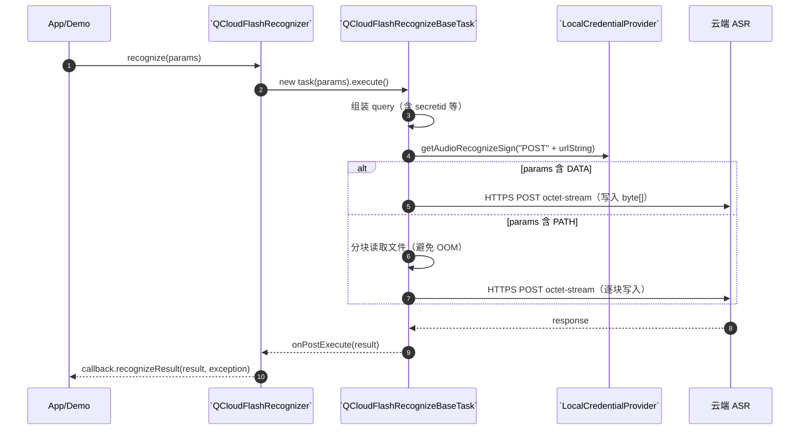

## 业务流程与时序图

本文档聚焦于 3 个 SDK 模块的**业务调用链**（App 如何调用 SDK）以及 SDK 内部的**关键交互时序**（音频采集/网络请求/签名/服务端回包）。

---

## `speech-demo` 调用概览

---

## `asr-realtime`（实时识别）

---

## `asr-one-sentence`（一句话识别）

---

## `asr-file-recognize`（极速文件识别）

