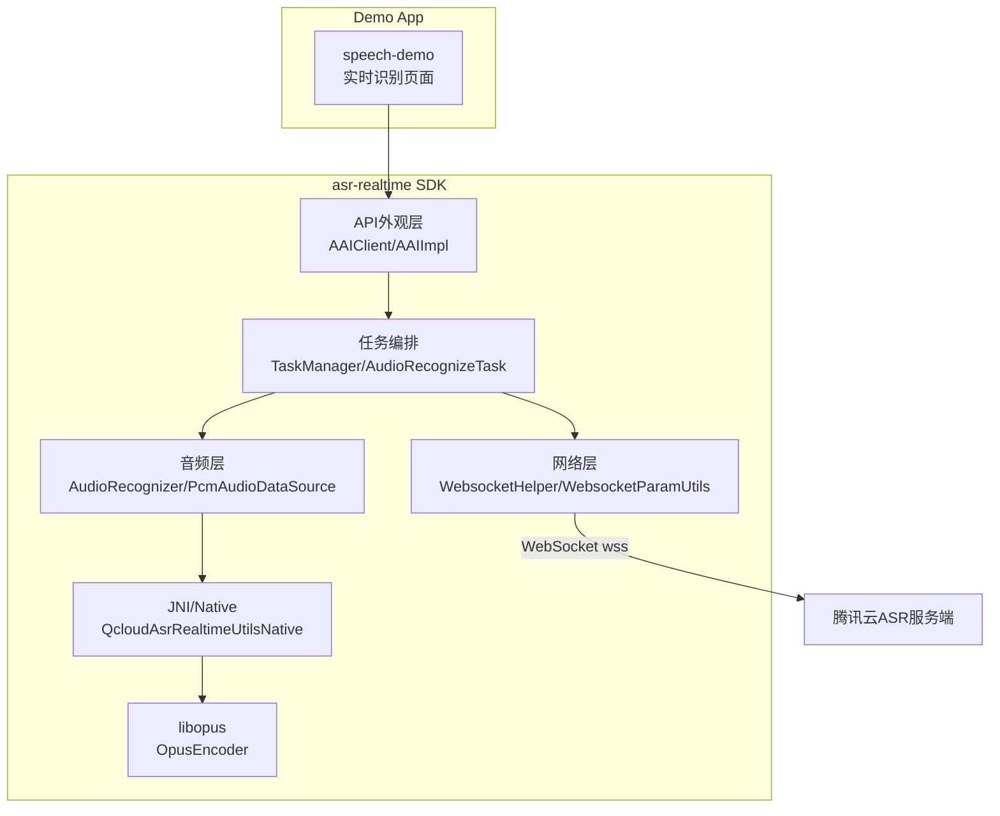
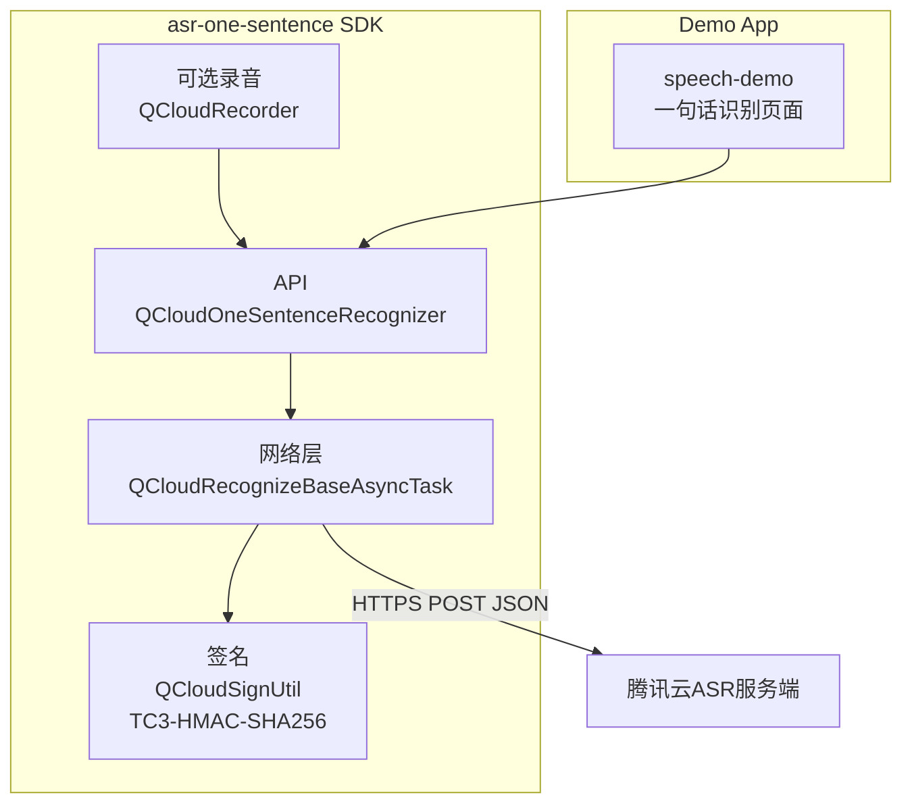
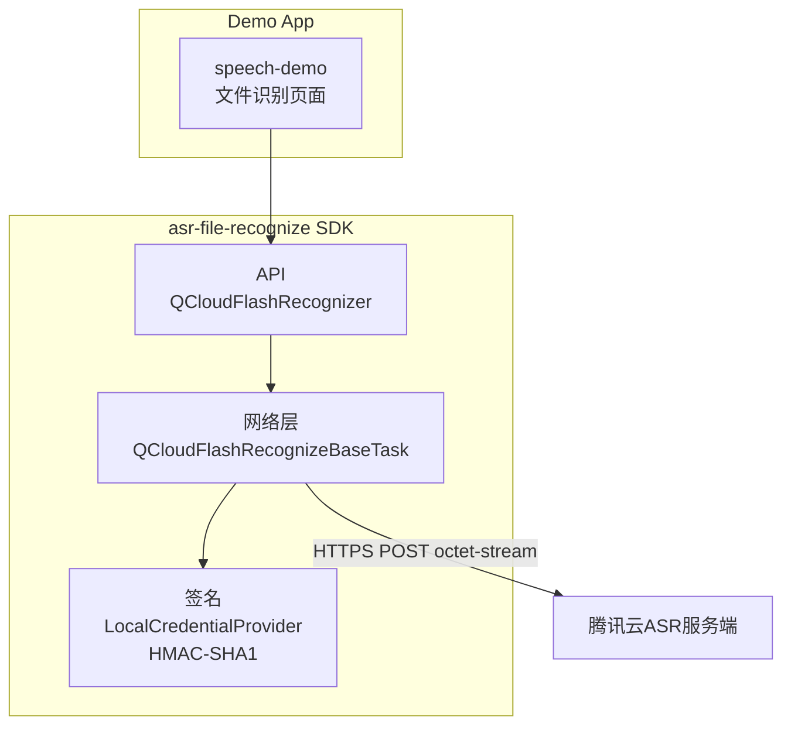

## 工程架构图

本文档聚焦于仓库 `cloud-asr-sdk-android2` 的**模块划分**与**内部层次结构**（API 层 / 任务编排 / 音频层 / 网络层 / Native 层），用于快速理解工程全貌。

---

## 整体架构图（模块/层次）

### 1. 实时识别 SDK 架构

### 2. 一句话识别 SDK 架构

### 3. 极速文件识别 SDK 架构

